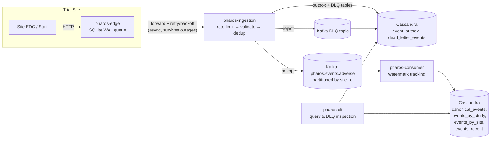

# Pharos

A distributed adverse-event ingestion pipeline for clinical trials — built to answer one real interview question honestly: *"design a system to track adverse drug events reported from clinical trials across multiple countries and time zones."*

It's grounded in a verified real interview question from Eli Lilly's Bio-IT / Clinical engineering team, and built out into a working product from there. It's not a broad pharmacovigilance suite competing with Oracle Argus, ArisGlobal, or Veeva Vault Safety — it's a focused answer to one hard piece of that problem: getting federated, multi-region adverse-event data into a central store correctly, with partition tolerance, exactly-once processing, and correct multi-timezone ordering, under real failure conditions.

## The four problems this actually solves

A trial site losing connectivity to the central system, a retry that could silently duplicate a record, a misbehaving site that shouldn't be able to degrade everyone else, and event timestamps that don't arrive in the order they happened — these are the four things this project exists to get right, not incidental features bolted onto a CRUD app.

**1. Network partition tolerance.** A site can lose connectivity for hours or days and must not lose or corrupt data. Each site runs a standalone edge collector with an embedded SQLite WAL queue — durability starts on local disk, not on the network being up. Forwarding to Central Ingestion is asynchronous with exponential-backoff-with-full-jitter retry, and can lag indefinitely without data loss.

**2. Exactly-once processing.** Retries are guaranteed to happen, so a duplicate must never become a second record, and a crash must never silently drop one. Central Ingestion uses a Cassandra-backed transactional outbox with a three-state claim/lease (`PUBLISHING` → `PUBLISHED`, won via a lightweight-transaction insert) before anything reaches Kafka — closing the exact crash window ("insert dedup key, then publish" as two unrelated steps) that a naive implementation gets wrong.

**3. Rate limiting and dead-letter handling.** One misbehaving site (bad clock, buggy client, malformed payload) can't be allowed to degrade ingestion for everyone else, and a rejected payload must be inspectable, not silently dropped. Per-site token-bucket rate limiting, scoped FHIR validation, and a durable dead-letter path (Cassandra + Kafka, both written *before* the edge is told "rejected") that's actually queryable via a CLI.

**4. Multi-timezone event ordering.** There's no single global order in a partition-tolerant system, and pretending otherwise doesn't survive scrutiny. Every event carries both event-time and ingestion-time; Kafka is partitioned by `site_id` to preserve per-site order; a downstream consumer tracks a watermark across sites with idle-partition exclusion (an offline site can't freeze progress for everyone else) and a monotonic guard (a reawakening site with backlogged old data can't push the clock backward).

## Architecture



Every trial site runs its own edge binary. Central Ingestion is the only thing that talks to Kafka. The consumer is a separate, independently-scalable process reading from Kafka into the queryable canonical store. `pharos-cli` is how you actually look at the data — the two named query patterns ("all events for trial X in date range Y", "all events from site Z") are separate purpose-built Cassandra tables, not secondary indexes on one table, because Cassandra needs partition-key-first modeling to perform.

## Tech stack

Go, Apache Kafka (KRaft mode, no ZooKeeper), Apache Cassandra — all self-hosted via Docker Compose, zero cloud spend. Notable dependencies, all pure-Go (no cgo): `segmentio/kafka-go` and `gocql` (Kafka/Cassandra clients), `modernc.org/sqlite` (the edge collector's local WAL durability), `prometheus/client_golang` (metrics), `redis/go-redis` (the optional distributed rate limiter, Slice 19), and `pgregory.net/rapid` (property-based testing, Slice 22).

## Running it locally

Cassandra runs as a 2-datacenter, 4-node cluster (dc-us: 3 nodes/RF=3, dc-eu:
1 node/RF=1) and Kafka as two independent clusters (cluster A: 3 brokers/
dc-us, cluster B: 1 broker/dc-eu) with MirrorMaker 2 replicating between
them (Slices 7, 14). Bring MirrorMaker 2 up *after* Cassandra/Kafka are
healthy and topics exist, not concurrently with everything else — starting
it before any topic exists makes it busy-loop discovery/retry, which has
caused real OOM kills on a memory-constrained host (see `docker-compose.yml`'s
own comments and `ARCHITECTURE_PROPOSALS.md`'s Slice 14 addendum).

Every Cassandra/Kafka client connection and Central Ingestion's own HTTP
listener require TLS by default (Slice 15) — `scripts/generate_certs.sh`
issues a project-owned CA and every service certificate into `certs/`
(gitignored; regenerate any time). Central Ingestion also requires per-site
API key auth by default (`--enable-auth` defaults `true`) — a site must be
provisioned with `pharos-cli site create-key` before its edge collector can
submit anything.

```bash
./scripts/generate_certs.sh   # one-time: project CA + every service's TLS cert, into certs/

docker compose up -d cassandra-1 cassandra-2 cassandra-3 cassandra-4 \
  kafka-1 kafka-2 kafka-3 kafka-4 prometheus grafana   # Cassandra + Kafka + observability
# wait for the 4 Cassandra + 4 Kafka + prometheus nodes to report healthy:
# docker compose ps (grafana has no healthcheck to wait on)

./scripts/create_topics.sh    # provisions topics with their real retention policies
docker compose up -d mirrormaker   # bring this up last -- see note above

make build                    # builds bin/pharos-edge, pharos-ingestion, pharos-consumer, pharos-cli, pharos-dashboard

./bin/pharos-cli site create-key SITE-DEMO-NG --ca-cert certs/ca-cert.pem
# API key created for site SITE-DEMO-NG. Save this now -- it cannot be shown again:
#   phk_...
# save the printed key, e.g.: SITE_API_KEY=phk_...

./bin/pharos-ingestion --port 8091 \
  --tls-cert certs/ingestion-cert.pem --tls-key certs/ingestion-key.pem \
  --ca-cert certs/ca-cert.pem &
./bin/pharos-consumer --ca-cert certs/ca-cert.pem &
./bin/pharos-edge --site-id SITE-DEMO-NG --port 8080 \
  --central-url https://localhost:8091/api/v1/events \
  --api-key "$SITE_API_KEY" --ca-cert certs/ca-cert.pem \
  --db-path /tmp/demo-edge.db &
```

Schemas and Kafka topic retention are bootstrapped automatically on startup — no manual migration step.

### Watch it work

Prefer to just watch it happen? `./scripts/demo.sh` runs every step below automatically against the real multi-node Cassandra/Kafka cluster — generates TLS certs if needed, brings up the full topology in the sequence above, provisions a per-site API key, starts the three services, submits a valid event, queries it back through the full pipeline, submits a malformed one, and shows it land in the DLQ — then shuts everything down. What follows is the same walkthrough by hand.

Submit a valid adverse event to the edge:

```bash
curl -X POST http://localhost:8080/api/v1/adverse-events \
  -H "Content-Type: application/json" \
  -d '{
    "resourceType": "AdverseEvent",
    "actuality": "actual",
    "subject": {"reference": "Patient/DEMO-001"},
    "event": {"coding": [{"system":"http://hl7.org/fhir/sid/meddra","code":"10012345","display":"Nausea"}], "text": "Severe Nausea"},
    "date": "2026-08-28T09:00:00+01:00",
    "recordedDate": "2026-08-30T05:13:00Z",
    "severity": {"coding": [{"code": "severe"}]},
    "study": [{"reference": "ResearchStudy/LILLY-401"}],
    "location": {"reference": "Location/SITE-DEMO-NG"}
  }'
# {"status":"QUEUED","idempotency_key":"SITE-DEMO-NG:1758...", "local_seq":1758..., ...}
```

The edge is still a plain local HTTP listener (TLS in Slice 15 is scoped to
the connections that actually leave the trusted site network — Central
Ingestion, Cassandra, Kafka — not the on-site capture endpoint). The
`local_seq` in the response is a composite instance-epoch + counter value
(Slice 8), not a simple incrementing integer, so copy the actual
`idempotency_key` from your own response for the next step rather than
assuming `SITE-DEMO-NG:1`.

A few seconds later, query it back through the full pipeline (edge → Central Ingestion → Kafka → consumer → Cassandra) using the `idempotency_key` from the response above:

```bash
./bin/pharos-cli query event SITE-DEMO-NG:1758... --ca-cert certs/ca-cert.pem
./bin/pharos-cli query site SITE-DEMO-NG --ca-cert certs/ca-cert.pem
./bin/pharos-cli query study LILLY-401 --from 2026-08-01T00:00:00Z --to 2026-08-31T23:59:59Z --ca-cert certs/ca-cert.pem
```

Now submit something invalid (missing `subject` and `event`) — the edge still buffers it durably (it never validates, by design), Central Ingestion rejects it with a structured reason, and it lands somewhere you can actually see it:

```bash
curl -X POST http://localhost:8080/api/v1/adverse-events \
  -H "Content-Type: application/json" \
  -d '{"resourceType":"AdverseEvent","actuality":"actual","date":"2026-08-28T09:00:00Z","recordedDate":"2026-08-30T05:14:00Z","location":{"reference":"Location/SITE-DEMO-NG"}}'

./bin/pharos-cli dlq list --site SITE-DEMO-NG --ca-cert certs/ca-cert.pem
# SITE-DEMO-NG:1758...  ...  subject reference is required (e.g., 'Patient/<id>')  PUBLISHED
```

Add `--memory` to any `pharos-cli` command to try it with built-in sample data, no Docker (and no `--ca-cert`) required.

### Or run the published image, no local build needed

Every service publishes a signed image to GHCR
(`.github/workflows/publish-image.yml`, triggered by a `v*` tag push or
manually via `workflow_dispatch`) — `ghcr.io/gasthecreator/pharos-{ingestion,consumer,edge,cli,dashboard}`,
tagged `:<short-sha>` per build and additionally `:<version>`/`:latest` on
a tagged release. Each image is keylessly signed (cosign + GitHub Actions
OIDC, no private key material) with SBOM and SLSA provenance attached:

```bash
docker run --rm ghcr.io/gasthecreator/pharos-cli:b499794 \
  query event SITE-DEMO-NG:1758... --memory

# Verify the signature before trusting it, the same way you'd verify any
# supply-chain-sensitive image:
cosign verify ghcr.io/gasthecreator/pharos-cli:b499794 \
  --certificate-identity-regexp 'https://github.com/gasthecreator/pharos/.github/workflows/publish-image.yml@.*' \
  --certificate-oidc-issuer https://token.actions.githubusercontent.com
```

`:b499794` is one real, currently-published tag — check the
[Packages page](https://github.com/gasthecreator/pharos/pkgs/container/pharos-cli)
for the current one rather than assuming this tag stays live forever, since
per-commit tags accumulate rather than move.

## How this was actually verified

Every one of the four core challenges is tested against real Cassandra and real Kafka — not mocks — including dedicated fault-injection tests (`internal/faultinjection`) for a total network partition, a partition healing *asymmetrically* (Central Ingestion finishes a write but the edge never sees the response, forcing a retry of an already-completed write), and out-of-order delivery.

Structured design review across the build caught real correctness bugs before they shipped, not after — five of the more notable ones:

- A concurrent-publish race in the original outbox design — two requests for the same event could both publish to Kafka.
- A watermark formula that looked right but could regress: a site reconnecting with backlogged old data could push the global clock backward.
- An audit-trail duplication bug under an ordinary Kafka redelivery — cosmetic, but exactly the kind of thing that undermines a compliance record's credibility.
- A Cassandra secondary index for dead-letter lookups that contradicted a partition-key-first modeling principle the project had already established for its other query tables one slice earlier.
- A Kafka retention policy that was fully documented and reasoned through — but, verified by checking the live broker directly rather than re-reading the code, had never actually been applied.

Every decision, review finding, and fix is in `WORKLOG.md` and `ARCHITECTURE_PROPOSALS.md` — dated, attributed, and left in rather than cleaned up after the fact, on purpose.

## What's here vs. what's next

This is genuinely engineered to production practices, not merely demo-ready — but it hasn't yet been operated in production at scale, and it's worth being direct about that difference rather than implying more maturity than exists. Observability (Prometheus + Grafana, Slice 6), a genuine multi-region cluster — dc-us: 3-node Cassandra/RF=3 + 3-broker Kafka, dc-eu: 1-node Cassandra/RF=1 + 1-broker Kafka, MirrorMaker 2 replication, `LOCAL_QUORUM` reads/writes (Slices 7, 14) — real per-site API-key auth and project-owned TLS across every service (Slice 15), real load-test numbers under real multi-site traffic (Slice 16: p95 ~101ms, confirmed per-site rate-limit isolation, the Cassandra outbox's Paxos LWT insert identified as the actual bottleneck), Kubernetes deployment manifests (Slice 17), a real backup/restore drill (Slice 18), 2+ instances of `pharos-consumer` sharing one Kafka consumer group (Slice 19), and durable access-audit logging for every `pharos-cli` query/DLQ/replay action (Slice 20) are all real, not aspirational. A server-rendered web dashboard (Slice 21) and a live chaos-injection control panel for demoing partition/duplicate/clock-skew recovery (Slice 23) sit on top of all of it. Closing the remaining gaps (see `PLAN.md`'s roadmap section, and its own "audit remediation" entries for the honest list of what's still deliberately deferred vs. what was simply found and fixed) is ongoing work, not a gap in what's already been built.

### Observability

`docker compose up -d` also brings up Prometheus (`:9090`) and Grafana (`:3000`, anonymous viewer access enabled for local use). All three services expose `/metrics` (ingestion and edge on their normal HTTP port; the consumer on `--metrics-port`, default `9091`, alongside `/healthz`). Grafana comes pre-provisioned with a "Pharos Overview" dashboard — request rates and latency, rate-limit/validation/dedup/DLQ counters, Kafka consumer lag and watermark freshness, Cassandra write latency, and edge queue depth/forwarder outcomes — no manual setup required, just open `http://localhost:3000` once traffic is flowing (e.g. via `scripts/demo.sh`).

## Repo layout

```
cmd/pharos-edge         Per-site collector: HTTP capture + SQLite WAL + forwarder
cmd/pharos-ingestion    Central Ingestion: rate-limit, validate, dedup/outbox, publish
cmd/pharos-consumer     Kafka consumer: watermarking, canonical Cassandra writes
cmd/pharos-cli          Query & DLQ inspection CLI
cmd/pharos-dashboard    Server-rendered web dashboard + chaos control panel (Slices 21, 23)
internal/               Implementation packages, one per concern above plus faultinjection
migrations/             Cassandra schema (bootstrapped automatically at startup too)
deploy/                 Dockerfiles and Kubernetes manifests for every service (Slice 17)
scripts/                Cert generation, topic provisioning, demo, backup/restore, load-test setup
loadtest/               k6 load-test script and its own README (Slice 16)
observability/          Prometheus scrape config + Grafana datasource/dashboard provisioning
nginx/                  TCP-passthrough load balancer in front of 2+ pharos-ingestion instances (Slice 19)
kafka/                  MirrorMaker 2 config for the dc-us/dc-eu replication topology
docs/api/               OpenAPI specs for the edge and Central Ingestion HTTP APIs
docs/security-threat-model.md   Per-component trust boundaries and known gaps
docs/benchmark-results.md       Real load-test numbers (Slice 16) and how to reproduce them
PLAN.md                 Living architecture doc — source of truth for every design decision
ARCHITECTURE_PROPOSALS.md   Proposal/review trail for every non-trivial design change
WORKLOG.md              Dated log of every implementation session, by whoever did it
CHANGELOG.md            What shipped, in product terms — see WORKLOG.md for the full story
CONTRIBUTING.md         Branch/PR/proposal-review workflow
CODE_OF_CONDUCT.md      Contributor Covenant
SECURITY.md             Security policy and known, deliberate gaps
```

## License

[MIT](LICENSE)
