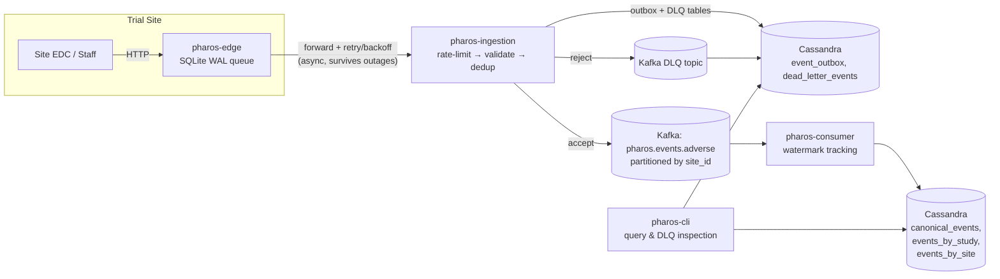

# Pharos

A distributed adverse-event ingestion pipeline for clinical trials — built to answer one real interview question honestly: *"design a system to track adverse drug events reported from clinical trials across multiple countries and time zones."*

This is grounded in a verified real interview question from Eli Lilly's Bio-IT / Clinical engineering team. It's a portfolio project, not a commercial product, and it deliberately doesn't compete with real pharmacovigilance platforms (Oracle Argus, ArisGlobal, Veeva Vault Safety). The point is distributed-systems engineering depth — partition tolerance, exactly-once processing, and correct multi-timezone ordering — demonstrated with a pharma-relevant payload, not domain science.

## The four problems this actually solves

A trial site losing connectivity to the central system, a retry that could silently duplicate a record, a misbehaving site that shouldn't be able to degrade everyone else, and event timestamps that don't arrive in the order they happened — these are the four things this project exists to get right, not incidental features bolted onto a CRUD app.

**1. Network partition tolerance.** A site can lose connectivity for hours or days and must not lose or corrupt data. Each site runs a standalone edge collector with an embedded SQLite WAL queue — durability starts on local disk, not on the network being up. Forwarding to Central Ingestion is asynchronous with exponential-backoff-with-full-jitter retry, and can lag indefinitely without data loss.

**2. Exactly-once processing.** Retries are guaranteed to happen, so a duplicate must never become a second record, and a crash must never silently drop one. Central Ingestion uses a Cassandra-backed transactional outbox with a three-state claim/lease (`PUBLISHING` → `PUBLISHED`, won via a lightweight-transaction insert) before anything reaches Kafka — closing the exact crash window ("insert dedup key, then publish" as two unrelated steps) that a naive implementation gets wrong.

**3. Rate limiting and dead-letter handling.** One misbehaving site (bad clock, buggy client, malformed payload) can't be allowed to degrade ingestion for everyone else, and a rejected payload must be inspectable, not silently dropped. Per-site token-bucket rate limiting, scoped FHIR validation, and a durable dead-letter path (Cassandra + Kafka, both written *before* the edge is told "rejected") that's actually queryable via a CLI.

**4. Multi-timezone event ordering.** There's no single global order in a partition-tolerant system, and pretending otherwise doesn't survive scrutiny. Every event carries both event-time and ingestion-time; Kafka is partitioned by `site_id` to preserve per-site order; a downstream consumer tracks a watermark across sites with idle-partition exclusion (an offline site can't freeze progress for everyone else) and a monotonic guard (a reawakening site with backlogged old data can't push the clock backward).

## Architecture



Every trial site runs its own edge binary. Central Ingestion is the only thing that talks to Kafka. The consumer is a separate, independently-scalable process reading from Kafka into the queryable canonical store. `pharos-cli` is how you actually look at the data — the two named query patterns ("all events for trial X in date range Y", "all events from site Z") are separate purpose-built Cassandra tables, not secondary indexes on one table, because Cassandra needs partition-key-first modeling to perform.

## Tech stack

Go, Apache Kafka (KRaft mode, no ZooKeeper), Apache Cassandra — all self-hosted via Docker Compose, zero cloud spend. `segmentio/kafka-go` and `gocql` are the only non-stdlib dependencies of note; both pure-Go, no cgo.

## Running it locally

```bash
docker compose up -d       # Kafka + Cassandra
make build                 # builds bin/pharos-edge, pharos-ingestion, pharos-consumer, pharos-cli
./bin/pharos-ingestion --port 8091 &
./bin/pharos-consumer &
./bin/pharos-edge --site-id SITE-DEMO-NG --port 8080 \
  --central-url http://localhost:8091/api/v1/events --db-path /tmp/demo-edge.db &
```

Schemas and Kafka topic retention are bootstrapped automatically on startup — no manual migration step.

### Watch it work

Prefer to just watch it happen? `./scripts/demo.sh` runs every step below automatically against real Cassandra/Kafka — starts the three services, submits a valid event, queries it back through the full pipeline, submits a malformed one, and shows it land in the DLQ — then shuts everything down. What follows is the same walkthrough by hand.

Submit a valid adverse event to the edge:

```bash
curl -X POST http://localhost:8080/api/v1/adverse-events \
  -H "Content-Type: application/json" \
  -d '{
    "resourceType": "AdverseEvent",
    "actuality": "actual",
    "subject": {"reference": "Patient/DEMO-001"},
    "event": {"coding": [{"system":"http://hl7.org/fhir/sid/meddra","code":"10012345","display":"Nausea"}], "text": "Severe Nausea"},
    "date": "2026-08-28T09:00:00+01:00",
    "recordedDate": "2026-08-30T05:13:00Z",
    "severity": {"coding": [{"code": "severe"}]},
    "study": [{"reference": "ResearchStudy/LILLY-401"}],
    "location": {"reference": "Location/SITE-DEMO-NG"}
  }'
# {"status":"QUEUED","idempotency_key":"SITE-DEMO-NG:1", ...}
```

A few seconds later, query it back through the full pipeline (edge → Central Ingestion → Kafka → consumer → Cassandra):

```bash
./bin/pharos-cli query event SITE-DEMO-NG:1
./bin/pharos-cli query site SITE-DEMO-NG
./bin/pharos-cli query study LILLY-401 --from 2026-08-01T00:00:00Z --to 2026-08-31T23:59:59Z
```

Now submit something invalid (missing `subject` and `event`) — the edge still buffers it durably (it never validates, by design), Central Ingestion rejects it with a structured reason, and it lands somewhere you can actually see it:

```bash
curl -X POST http://localhost:8080/api/v1/adverse-events \
  -H "Content-Type: application/json" \
  -d '{"resourceType":"AdverseEvent","actuality":"actual","date":"2026-08-28T09:00:00Z","recordedDate":"2026-08-30T05:14:00Z","location":{"reference":"Location/SITE-DEMO-NG"}}'

./bin/pharos-cli dlq list --site SITE-DEMO-NG
# SITE-DEMO-NG:2  ...  subject reference is required (e.g., 'Patient/<id>')  PUBLISHED
```

Add `--memory` to any `pharos-cli` command to try it with built-in sample data, no Docker required.

## How this was actually verified

Every one of the four core challenges is tested against real Cassandra and real Kafka — not mocks — including dedicated fault-injection tests (`internal/faultinjection`) for a total network partition, a partition healing *asymmetrically* (Central Ingestion finishes a write but the edge never sees the response, forcing a retry of an already-completed write), and out-of-order delivery.

Structured design review across the build caught real correctness bugs before they shipped, not after — five of the more notable ones:

- A concurrent-publish race in the original outbox design — two requests for the same event could both publish to Kafka.
- A watermark formula that looked right but could regress: a site reconnecting with backlogged old data could push the global clock backward.
- An audit-trail duplication bug under an ordinary Kafka redelivery — cosmetic, but exactly the kind of thing that undermines a compliance record's credibility.
- A Cassandra secondary index for dead-letter lookups that contradicted a partition-key-first modeling principle the project had already established for its other query tables one slice earlier.
- A Kafka retention policy that was fully documented and reasoned through — but, verified by checking the live broker directly rather than re-reading the code, had never actually been applied.

Every decision, review finding, and fix is in `WORKLOG.md` and `ARCHITECTURE_PROPOSALS.md` — dated, attributed, and left in rather than cleaned up after the fact, on purpose.

## What's here vs. what's next

This is genuinely portfolio-ready, not production-ready — those are different bars, and it's worth being direct about the difference rather than implying more maturity than exists. There's no authentication or TLS anywhere; nothing has been load-tested at real throughput; there's no deployment automation, backup/DR plan, or multi-instance scaling ever exercised. Observability (Prometheus + Grafana, Slice 6) and a genuine multi-node cluster — 3-node Cassandra at replication factor 3, 3-broker Kafka, `LOCAL_QUORUM` reads/writes (Slice 7) — are both real, not aspirational; closing the rest of the gap is ongoing work, not a gap in what's already been built; see `PLAN.md`'s roadmap section for the specifics.

### Observability

`docker compose up -d` also brings up Prometheus (`:9090`) and Grafana (`:3000`, anonymous viewer access enabled for local use). All three services expose `/metrics` (ingestion and edge on their normal HTTP port; the consumer on `--metrics-port`, default `9091`, alongside `/healthz`). Grafana comes pre-provisioned with a "Pharos Overview" dashboard — request rates and latency, rate-limit/validation/dedup/DLQ counters, Kafka consumer lag and watermark freshness, Cassandra write latency, and edge queue depth/forwarder outcomes — no manual setup required, just open `http://localhost:3000` once traffic is flowing (e.g. via `scripts/demo.sh`).

## Repo layout

```
cmd/pharos-edge         Per-site collector: HTTP capture + SQLite WAL + forwarder
cmd/pharos-ingestion    Central Ingestion: rate-limit, validate, dedup/outbox, publish
cmd/pharos-consumer     Kafka consumer: watermarking, canonical Cassandra writes
cmd/pharos-cli          Query & DLQ inspection CLI
internal/               Implementation packages, one per concern above plus faultinjection
migrations/             Cassandra schema (bootstrapped automatically at startup too)
docs/api/               OpenAPI specs for the edge and Central Ingestion HTTP APIs
PLAN.md                 Living architecture doc — source of truth for every design decision
ARCHITECTURE_PROPOSALS.md   Proposal/review trail for every non-trivial design change
WORKLOG.md              Dated log of every implementation session, by whoever did it
CONTRIBUTING.md         Branch/PR/proposal-review workflow
SECURITY.md             Security policy and known, deliberate gaps
```

## License

[MIT](LICENSE)
